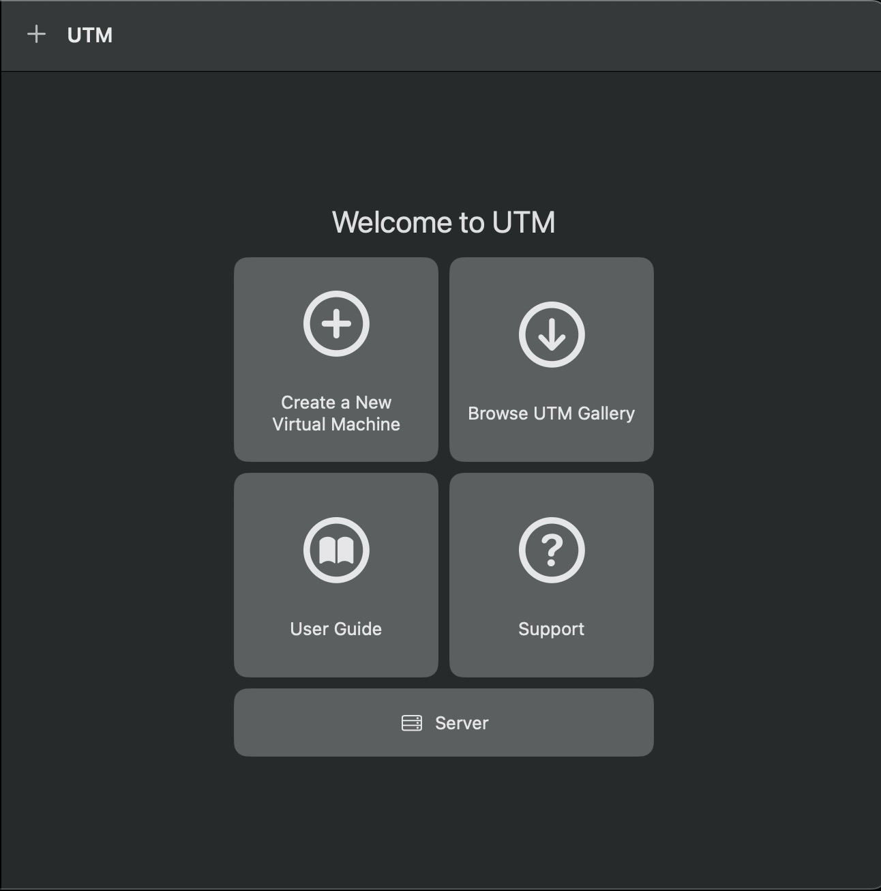
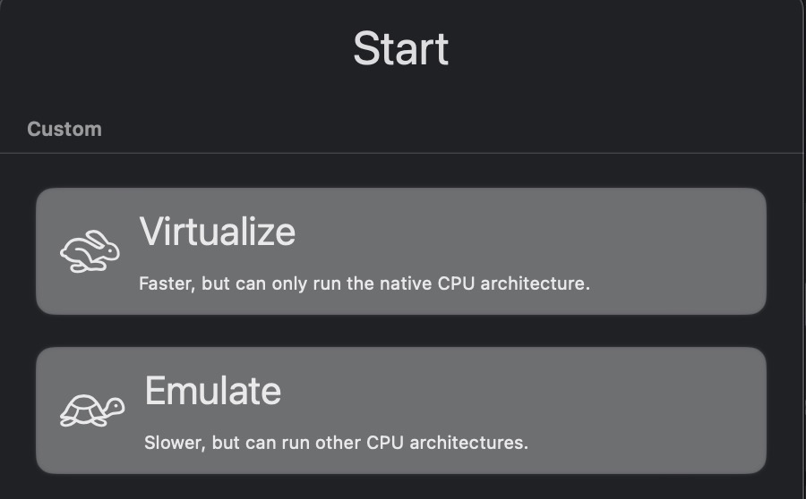
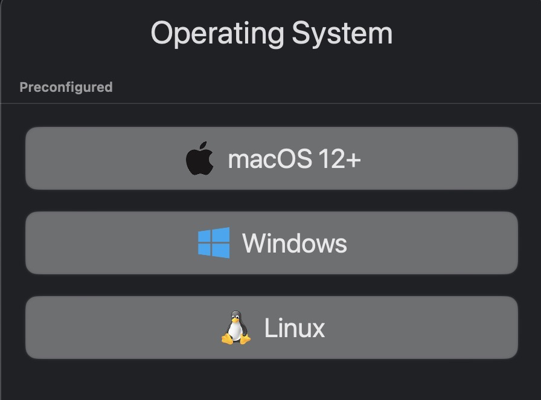
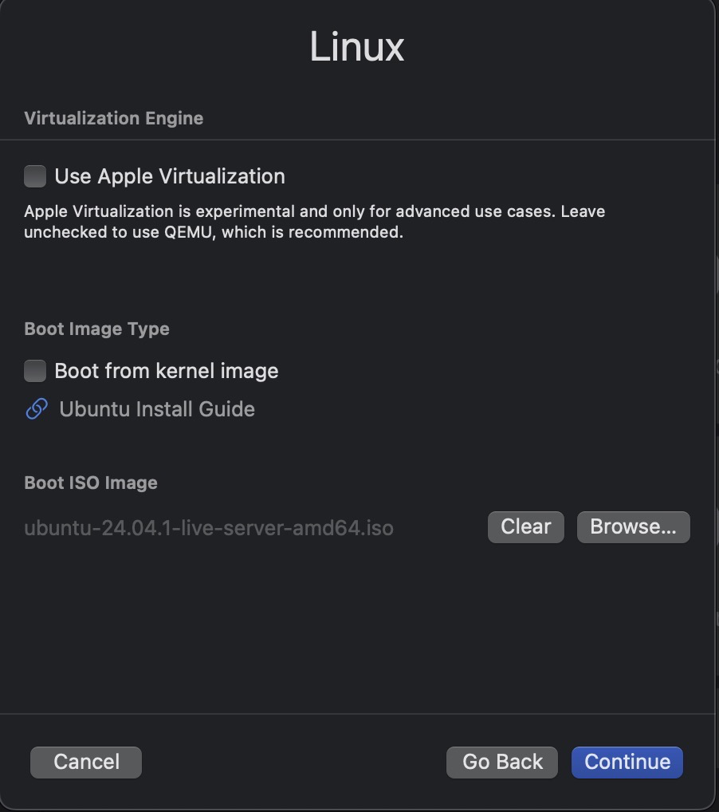
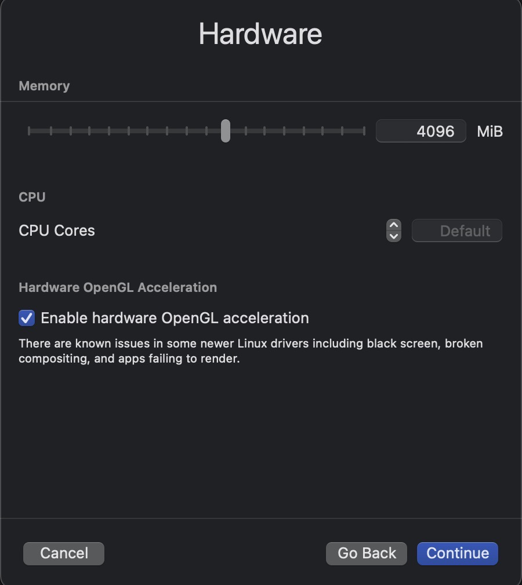
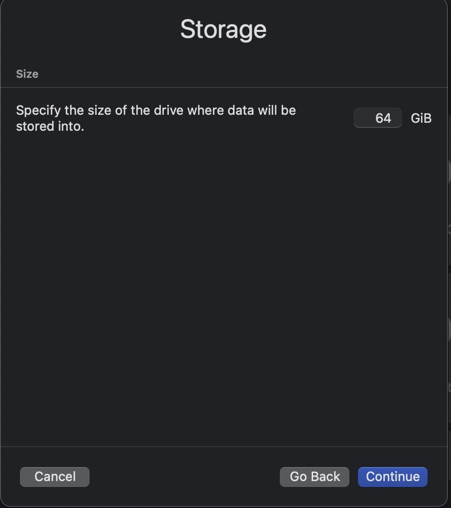
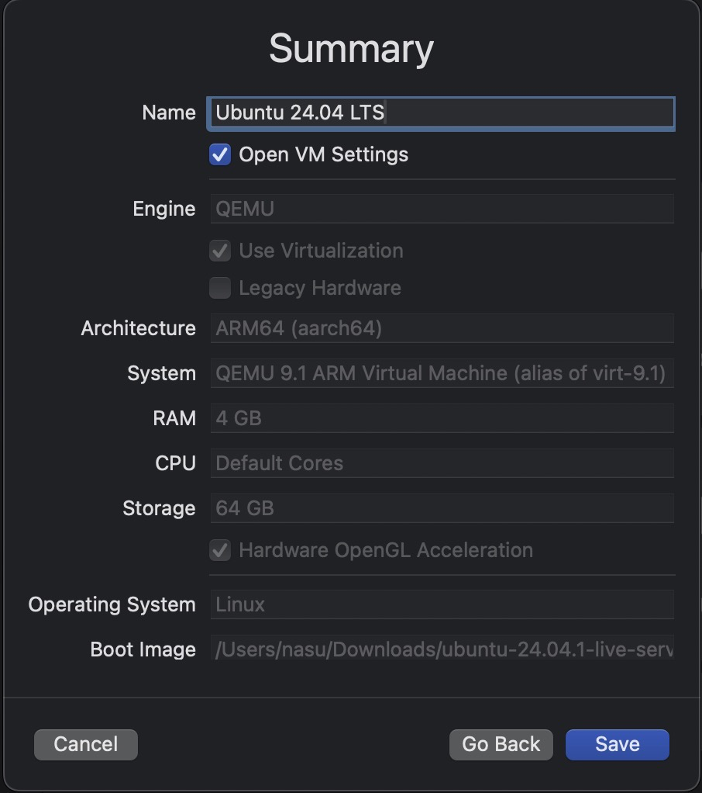
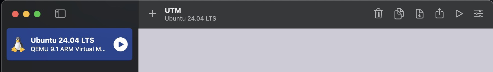
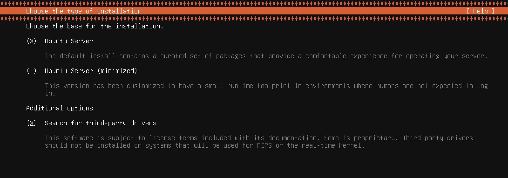
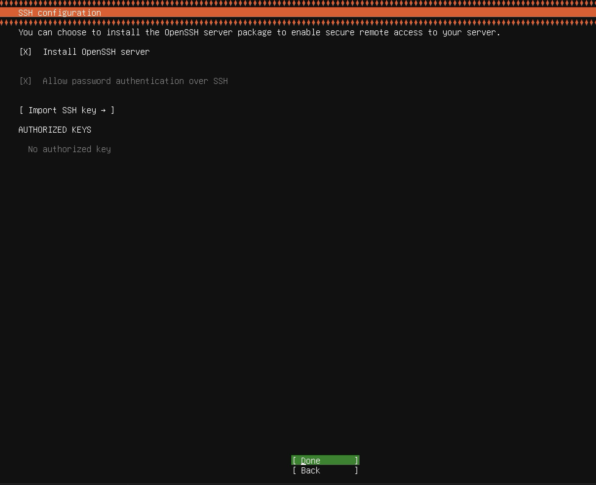

# Installing Ubuntu On Mac M3

These is a working sample for creating Ubuntu 24 LTS in MAC M3

## Downloads

- Securely run Ubuntu 24.04 on your Mac by using UTM. Download the [file](https://github.com/utmapp/UTM/releases/latest/download/UTM.dmg) and Install. 
- Download the latest LTS version of [Ubuntu Server ARM64](https://cdimage.ubuntu.com/releases/24.04/release/ubuntu-24.04.1-live-server-arm64.iso?_gl=1*9525lh*_gcl_au*NDc5MDEwMzMxLjE3MzYwNTg4MTk.&_ga=2.63458351.1641015940.1736058800-467031439.1736058800). LTS stands for long-term support — which means five years of free security and maintenance updates.

## Installation

- __UTM | Virtual machines for Mac__

    ```
    1. Double-click the downloaded file.
    2. Drag and drop the UTM -> Applications
    3. Wait for the installation to be completed.
    4. Open it.
    ```

- __Ubuntu 24.04 LTS__

    1. In UTM window, click ___Create a New Virtual Machine___.
        
    2. Click ___Virtualize___.
        
    3. Select ___Linux___ as your operating system.
        
    4. Click the ___Browse___ button and select recently downloaded iso and click Continue.
        
    5. Input your ___Hardware___ options or use the default. 
         
    6. Select your ___Storage___ and continue.
        
    7. Enter you desired ___Name___ and save.
        
    8. Click the Play button to start installation.
        
    9. Just use all the default settings until you go to this page.
        
    10. Enable OpenSSH.
        
    11. Wait until the install is done and click Reboot Now.
    
## Add Ubuntu Desktop and Spice Agent

```
sudo apt update -y
sudo apt install tasksel
sudo apt install ubuntu-desktop
sudo apt install spice-vdagent
sudo apt install spice-webdavd
